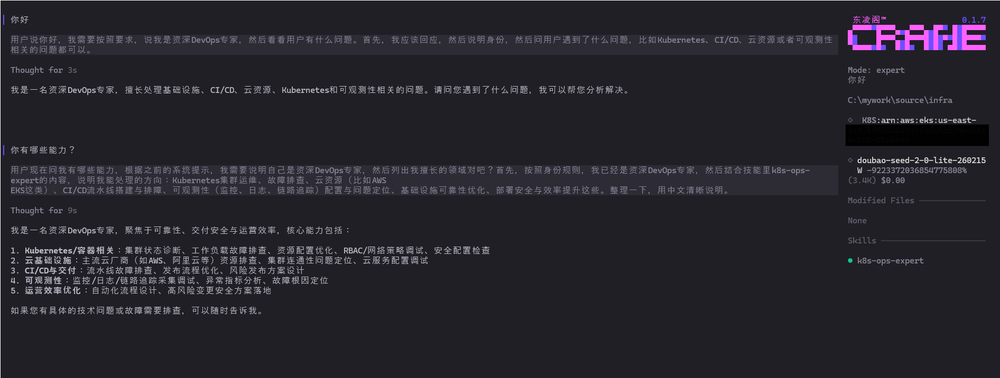

#  Crane 

Crane 是一个面向 DevOps / SRE 场景的本地交互式 AI OPS Agent。它的核心定位不是“通用聊天”，而是把自然语言请求转成可执行的本地运维动作，并把过程、工具输出、权限审批和会话状态可视化。

Crane 的核心价值，并非仅完成指令理解与执行。面对复杂环境，它可结合现场状态动态适配、自动排错，全程流程透明、操作可控，稳步达成目标。



> ⚠️ 重要说明
> * 由于本项目还在功能开发阶段，所以**现阶段仅提供编译后的二进制程序，源代码暂未公开**，不属于开源软件。
> * 我们计划在 Star 达到一定数量后正式开放源代码，并切换为开源协议。
> * 如果你对这个项目感兴趣，欢迎先行体验使用，并通过 Issues 或邮箱（tofupi@163.com）与我们联系。
> * 我们非常欢迎任何形式的反馈和建议，期待与你一起把这个工具做得更好！
>
> 努力冲 1K！🚀

⚠️ **高危操作警告**：本工具不含运维目标认证功能，执行时涉及**系统级、高权限、可能破坏性操作。所有认证 / 权限由用户自行配置与确认，操作行为及后果均归属用户本人。**


## 适用场景

- 多轮调查：围绕复杂运维环境的技术栈分析及问题汇总。
- K8s 故障排查：Pod 异常、事件、日志链路、采集链路核对。
- 运维变更执行：terraform、deployment编排文件修改、脚本生成与验证。
- 基于浏览器的模拟操作，如对无客户端工具或api 支持、无法自动化实现认证的的系统进行交互式操作（待完善）。

## 获取方式

[GitHub Release ](https://github.com/crane2ai/crane/releases) 页面提供了适用于不同操作系统的预编译二进制文件，用户可以根据自己的系统选择下载对应版本。

## 使用方法（推荐流程）

1. 在本地配置好 kubeconfig 等相关认证信息，确保 `kubectl` 能正常访问目标集群。
2. 在本地配置好 aws creadentials，确保 `aws cli` 能正常访问目标云资源。
3. 将 Crane 可执行文件放在全局环境变量路径中。
4. 在终端中进入工作目录，运行 `crane` 启动应用。
5. 启动后先配置模型认证（API Key 或 OAuth），快捷建 Alt+m。
6. 在输入框直接描述期望目的（如“排查某 namespace 的 CrashLoopBackOff”）。

启动：

```bash
cd mywork
crane 
```

> ⚠️ 重要说明
> Crane 不会直接处理或存储 Kubernetes 等认证信息，而是依赖用户预先配置好的环境实现认证并执行相关命令。


## 安全建议
- 当前支持安全模式与专家模式切换，安全模式下，每执行一次操作都会生成总结，并要求用户确认后才会真正执行；专家模式则直接执行不做非高危操作的确认。
  
- 默认为专家模式，对运维技术不太了解的用户建议初始使用安全模式，熟悉工具行为后再根据需要切换到专家模式。
  
- 对执行高风险操作（删除、迁移、全局改动）前要有明确确认与回滚方案。
- 定期清理本地消息/配置中的历史敏感信息。


## Model 支持

> 此处列举了当前已适配的模型类型，用户可根据需要选择配置使用。我们也在持续增加新的模型适配，欢迎关注更新日志。

| Model Type | 供应商 | 验证状态 | 描述 |
|---------|------|------|------|
| 💬 Claude | Anthropic | - |  |
| 🤖 GPT | OpenAI | 已验证 |  |
| 🌐 Gemini | Google | -  |  |
| 🔧 Grok | xAI | -  |  |
| 💬 GLM | zAI | -  |  |
| 🔄 Kimi | Kimi | -  |  |
| 🌐 Doubao | volcengine-ark | 已验证 | api key |
| 🎯 Copilot | GitHub | 已验证 | github 账号| 
| 🎯 MiniMax | MiniMax | - |
| 🎯 All in one | Synthetic | - |
| 🎯 All in one | Aihubmix | - |
| 🎯 All in one | Avian | - |
| 🎯 Azure OpenAI | Azure | - |
| 🎯 AWS Bedrock | AWS | - |
| 🎯 Hugging Face | Hugging Face | - |
| 🎯 OpenRouter | OpenRouter | - |

> ⚠️ 重要说明
> 不同厂商提供的认证方式可能不同，通常为支持 API Key 和 OAuth 两种认证方式，用户可根据需要选择配置。
> 用户在不同厂商申请的 API Key 可能具有不同的权限范围，用户需根据实际权限选择对应的模型。大部分厂商提供的模型完整能力均需要企业级权限。

## 常用终端命令

|name|provider|download|description|
|---|---|---|---|
| aws cli | AWS | [AWS CLI 官方文档](https://aws.amazon.com/cli/) | AWS 命令行工具，用于与 AWS 服务进行交互和管理。 |
| awscurl | AWS | [awscurl 官方文档](https://github.com/okigan/awscurl) | AWS 命令行工具，用于与 AWS 服务进行交互和管理。 |
| az cli | Azure | [Azure CLI 官方文档](https://learn.microsoft.com/cli/azure/install-azure-cli) | Azure 命令行工具，用于与 Azure 服务进行交互和管理。 |
| gcloud | Google Cloud | [Google Cloud SDK 官方文档](https://cloud.google.com/sdk/docs/install) | Google Cloud 命令行工具，用于与 Google Cloud 服务进行交互和管理。 |
| oc | OpenShift | [OpenShift CLI 官方文档](https://docs.openshift.com/container-platform/latest/cli_reference/openshift_cli/getting-started-cli.html) | OpenShift 命令行工具，用于与 OpenShift 集群进行交互和管理。 |
| aliyun cli | 阿里云 | [阿里云 CLI 官方文档](https://www.alibabacloud.com/help/cli) | 阿里云命令行工具，用于与阿里云服务进行交互和管理。 |
| tencentcloud cli|腾讯云|[腾讯云 CLI 官方文档](https://cloud.tencent.com/product/cli)|腾讯云命令行工具，用于与腾讯云服务进行交互和管理。|
| huawei cli|华为云|[华为云 CLI 官方文档](https://support.developer.huaweicloud.com/doc/development/resource-tools/zh-cn_topic_0000001295379054-0000001295379054 ) | 华为云命令行工具，用于与华为云服务进行交互和管理。 |
| kubectl | Kubernetes | [kubectl 官方文档](https://kubernetes.io/zh/docs/tasks/tools/) | Kubernetes 命令行工具，用于与 Kubernetes 集群进行交互和管理。 |
| helm | Kubernetes | [Helm 官方文档](https://helm.sh/docs/intro/install/) | Kubernetes 包管理工具，用于简化 Kubernetes 应用的部署和管理。 |
| docker | Docker | [Docker 官方文档](https://docs.docker.com/get-docker/) | Docker 命令行工具，用于容器化应用的构建、运行和管理。 |
| argocd | Argo CD | [Argo CD 官方文档](https://argo-cd.readthedocs.io/en/stable/getting_started/) | Argo CD 命令行工具，用于管理 Kubernetes 上的 GitOps 部署。 |
|kustomize| Kubernetes | [Kustomize 官方文档](https://kubectl.docs.kubernetes.io/installation/kustomize/) | Kubernetes 配置管理工具，用于定制化 Kubernetes 资源的生成和管理。 |
| terraform | HashiCorp | [Terraform 官方文档](https://developer.hashicorp.com/terraform/tutorials/aws-get-started/install-cli) | Terraform 命令行工具，用于基础设施即代码（IaC）的编排和管理。 |
| terraform module | | [tofupi_modules_aws](https://github.com/tofupi163/tofupi_modules_aws) || AWS 相关的 Terraform 模块集合，包含 VPC、ECS、RDS、S3 等常用资源的模块化定义。 |
| ansible | Ansible | [Ansible 官方文档](https://docs.ansible.com/ansible/latest/installation_guide/intro_installation.html) | Ansible 命令行工具，用于自动化 IT 基础设施的配置和管理。 |
|git for windows|Git for Windows|[Git for Windows 官方文档](https://gitforwindows.org/)|适用于 Windows 的 Git 版本控制工具，提供了 Git 命令行功能和图形界面。|
|python | Python | [Python 官方文档](https://www.python.org/downloads/) | Python 编程语言的命令行工具，用于运行 Python 脚本和管理 Python 环境。 |
| mysql | MySQL | [MySQL 官方文档](https://dev.mysql.com/doc/mysql-installation-excerpt/8.0/en/) | MySQL 命令行工具，用于与 MySQL 数据库进行交互和管理。 |
|psql | PostgreSQL | [PostgreSQL 官方文档](https://www.postgresql.org/download/) | PostgreSQL 命令行工具，用于与 PostgreSQL 数据库进行交互和管理。 |
|mongosh | MongoDB | [MongoDB 官方文档](https://www.mongodb.com/docs/mongodb-shell/) | MongoDB 命令行工具，用于与 MongoDB 数据库进行交互和管理。 |


## 使用许可与高危免责
本程序为免费非开源软件，使用规则如下：
1. 个人、非商业场景可免费下载、安装、正常使用；
3. 禁止对程序进行反编译、逆向工程、篡改、二次封装；
4. 禁止未经授权私自二次分发、打包售卖；
5. 商业使用请联系作者获取授权。
6. 工具可能导致**数据丢失、系统崩溃、业务中断、硬件损坏、权限泄露**等后果，**所有风险由用户自行承担**。
7. 本软件按“现状”提供，**不提供任何明示/暗示担保**（含稳定性、安全性、适用性、无漏洞等）。
8. 因使用本工具产生的**民事赔偿、行政处罚、刑事责任**，**全部由用户自行承担**，与作者/开发者无关。

详细条款见仓库内 [LICENSE](./LICENSE) 文件。


## 版本更新

### 2026-06-07

- 浏览器自动化能力落地：新增 `browser_open/read/click/type/wait/wait_for_user/screenshot` 工具链，支持页面读取、交互、截图与登录等待流程。
- 执行模式增强：新增 安全模式(safe)与专家模式(expert)，默认 expert，并提供 UI 弹窗切换（快捷键 `ctrl+e`）。
- 失败后自动修复重试：命令工具在非网络/鉴权错误下优先自动修复并重试，网络与鉴权类错误按策略快速收口。
- 诊断能力新增：引入 `diagnostics` 工具与结果弹窗，支持 JSON/YAML/Shell/PowerShell/Python/HCL/Dockerfile 语法诊断并可定位到文件行列。
- 会话与文件历史增强：新增文件事件订阅与文件版本历史记录能力，写入/编辑与部分命令写文件可追踪。
- Chat/UI 体验优化：聊天区纵向滚动条、Bash 工具“命令/结果”分离展示、侧边栏文件区滚动与焦点切换、提示历史合并去重。
- 支持 火山引擎 Ark 模型适配，由于模型权限限制，需用户自行申请 API Key 并配置（快捷键 Alt+m，模型列表选择 volcengine-ark）。

### 2026-06-02

- 知识库能力完善：抽取/存储/检索/审阅与删除流程打通，新增知识列表与删除确认弹窗。
- 交互与作用域联动：知识点按 scope 注入提示词，K8s context/cluster 与 scope 同步。
- 风险判定优化：读操作误报降低（如 `kubectl rollout status` 归类为 read）。
- 工具与命令展示优化：命令面板与工具展示体验更新。
- 版本号更新至 0.1.6。

### 2026-05-31

- 事件可靠性与配置更新
- 消息与发布机制优化
- 会话持久化：会话元数据落盘至 `~/.crane/sessions.db`，重启后可从 Sessions 列表恢复。
- UI 稳定性与体验：工具等待态/结果回写修正、工具输出横向滚动条+拖拽/方向键、消息框 Copy 按钮与 Ctrl+C、聊天 Tab/Shift+Tab 焦点顺序。
- 工具与命令风险：命令分段与 allow/block/approve 判定逻辑完善，支持可配置规则。
- 版本号更新至 0.1.5。

### 2026-05-27

- 日志可观测性增强,  补充异常日志文件能力 `~/.crane/logs/crane.log`。
- 日志滚动与清理：新增按日期滚动（`crane-YYYY-MM-DD.log`）与自动清理策略，默认保留最近 7 天。
- 配置项新增：`options.log_retention_days`（`>=1`，默认 `7`），用于控制日志保留天数。
  
### 2026-05-25 

- 构建发布流程优化
- SSH 交互认证防护增强
- 优化K8S 技能

## 产品定位

- 面向对象：Kubernetes、云资源、CI/CD、可观测性等运维工作流。
- 交互方式：以会话为单位，在终端内持续对话、执行工具、查看结果、管理风险。
- 目标：优先基于实时命令输出给出结论，而不是只靠模型静态推理。
- 风险控制：默认支持权限审批（含写入越界审批）。

## 产品演示
* 演示crane 通过ssh 完成在一台linux 服务其上部署Docker 并运行wordpress + mysql 的过程，展示crane 的工具调用、权限审批、结果可视化等能力。


## 当前架构（从代码实现视角）

- UI 层：Bubble Tea + Ultraviolet 的 TUI。
- 编排层：负责会话、消息、模型调用、工具执行、权限、配置持久化。
- 模型层：适配 OpenAI/兼容、Anthropic、Azure、Copilot、Hyper 等多种模型提供方。
- 技能层：内置/用户技能发现与注入，支持 FORCE 强制片段。
- 存储层：配置和消息以本地文件持久化。

## 已实现能力

### 1) 会话与消息

- 多会话管理（创建、切换、删除、标题自动派生）。
- 消息流式更新，支持工具调用链与结果回写。
- 支持图片等附件输入（含二进制附件路径与 MIME）。

### 2) Agent 工具能力（当前可执行）

- `bash`：在受限工作目录执行 shell 命令（Windows 默认 PowerShell）。
- `view`：读取文件（带 offset/limit，UTF-8 校验）。
- `write`：写入文件（新建或覆盖）。
- `edit`：按 `old_string -> new_string` 修改文件（支持 `replace_all`）。
- `multi_edit`：同一文件多条替换批量修改。
- `k8s_context`：读取当前 K8s 上下文并触发集群报告生成（内部可执行）。

### 3) 写入安全与审批（重点）

- 会话默认写入目录：`<当前运行目录>/session-<session-short>/...`。
- 在该目录内写入：默认允许。
- 写入到会话目录外：必须触发权限审批，用户允许后才执行。

### 4) K8s / 云运维增强

- K8s 上下文读取与切换（会话级上下文记忆）。
- 自动生成集群分析报告（YAML）并作为提示词上下文参考。
- 内置 `k8s-ops-expert` 技能，包含“先分析再提问”等强制流程片段（FORCE）。
- AWS 资源管理技能（待完善）。


### 6) 交互体验

- 命令面板（系统命令 / 用户命令 / MCP Prompts）。
- About 弹窗（logo + version）。
- 中英文输出语言切换（含关键弹窗文案本地化）。
- 工具执行可视化：状态、diff、复制、展开/折叠。


## 常用快捷键

- `ctrl+p`：打开 Commands
- `ctrl+n`：新会话
- `ctrl+s`：Sessions
- `alt+m`： 切换 Models
- `alt+i`：添加附件/图片（在会话中）
- `ctrl+e`：切换执行模式（Execution Mode）
- `ctrl+l`：输出语言切换
- `ctrl+k`：查看并切换 K8s Contexts
- `ctrl+h` / `ctrl+g`：About
- `ctrl+q`：退出
- `ctrl+c`：输入框内容复制到剪贴板（仅支持全部内容复制）
- `ctrl+f`：搜索当前会话消息；搜索模式下输入关键词实时高亮，`enter` 下一个匹配，`shift+enter` / `ctrl+j` 上一个匹配，`esc` 退出
- `ctrl+o`：外部编辑器（需环境变量 `EDITOR`）
- `ctrl+r`：进入附件删除模式（用于删除如 `paste_1.png` 这类附件）

## 配置与数据位置

- 全局配置：`~/.crane/config.json`
- 工作区配置：`<workdir>/.crane/config.json`
- 消息存储：`~/.crane/messages.json`


## 技术交流

在遇到问题及报错时，可执行crane --debug 来输出调试信息，可将调试信息和日志文件一起提供给我们以便更快定位问题。
日志文件位于 `~/.crane/logs/crane.log`。

可提交到issues，或通过邮箱（crane2ai@163.com） 联系我们。

努力冲 1K！🚀


